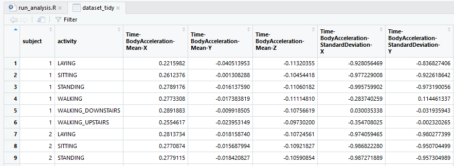

# CodeBook.md

The purpose of this project is to demonstrate your ability to collect, work with, and clean a data set. The goal is to prepare tidy data that can be used for later analysis. You will be graded by your peers on a series of yes/no questions related to the project. You will be required to submit: 1) a tidy data set as described below, 2) a link to a Github repository with your script for performing the analysis, and 3) a code book that describes the variables, the data, and any transformations or work that you performed to clean up the data called CodeBook.md. You should also include a README.md in the repo with your scripts. This repo explains how all of the scripts work and how they are connected.

One of the most exciting areas in all of data science right now is wearable comput~ing - see for example this article . Companies like Fitbit, Nike, and Jawbone Up are racing to develop the most advanced algorithms to attract new users. The data linked to from the course website represent data collected from the accelerometers from the Samsung Galaxy S smartphone. A full description is available at the site where the data was obtained:

http://archive.ics.uci.edu/ml/datasets/Human+Activity+Recognition+Using+Smartphones

Here are the data for the project:

https://d396qusza40orc.cloudfront.net/getdata%2Fprojectfiles%2FUCI%20HAR%20Dataset.zip

Source code : run_analysis.R

### Download dataset ###

In this section, the code checks if folder 'UCI HAR Dataset' exist, if not, it downloads dataset file from given url and unzip it. 

    if (!dir.exists('UCI HAR Dataset')) {
      if (!file.exists('getdata_projectfiles_UCI HAR Dataset.zip')) {
        message('Downloading dataset... ')
        download.file(url = 'https://d396qusza40orc.cloudfront.net/getdata%2Fprojectfiles%2FUCI%20HAR%20Dataset.zip', 
                      destfile = 'getdata_projectfiles_UCI HAR Dataset.zip', quiet = TRUE)
      }
      
      unzip('getdata_projectfiles_UCI HAR Dataset.zip')
      message('Dataset file is unzipped... ')
    } else
    {
      message('"Dataset folder found, skip downloading...')
    }

### 1. Merges the training and the test sets to create one data set ###

The first step is to read features.txt from dataset folder into a variable named features.

    features <- read.table('./UCI HAR Dataset/features.txt', header = FALSE)

The code then read training and test data tables into named variables.

    subject_train <- read.table('./UCI HAR Dataset/train/subject_train.txt', header = FALSE) %>% setNames(c('subject'))
    y_train <- read.table('./UCI HAR Dataset/train/Y_Train.txt', header = FALSE) %>% setNames(c('activity'))
    x_train <- read.table('./UCI HAR Dataset/train/X_train.txt', header = FALSE) %>% setNames(features[,2])
    
    subject_test <- read.table('./UCI HAR Dataset/test/subject_test.txt', header = FALSE) %>% setNames(c('subject'))
    y_test <- read.table('./UCI HAR Dataset/test/y_test.txt', header = FALSE) %>% setNames(c('activity'))
    x_test <- read.table('./UCI HAR Dataset/test/X_test.txt', header = FALSE) %>% setNames(features[,2])

Next, training dataset and test dataset data frames are created using cbind function.

    training_dataset <- cbind(subject_train, y_train, x_train)
    test_dataset <- cbind(subject_test, y_test, x_test)

After the 2 datasets are ready, I used rbind to concatinate them together.

    merged_dataset <- rbind(training_dataset,test_dataset)

Now we have the merged dataset like this:

    >str(merged_dataset)
    'data.frame':	10299 obs. of  563 variables:
     $ subject                             : int  1 1 1 1 1 1 1 1 1 1 ...
     $ activity                            : int  5 5 5 5 5 5 5 5 5 5 ...
     $ tBodyAcc-mean()-X                   : num  0.289 0.278 0.28 0.279 0.277 ...
     $ tBodyAcc-mean()-Y                   : num  -0.0203 -0.0164 -0.0195 -0.0262 -0.0166 ...
     $ tBodyAcc-mean()-Z                   : num  -0.133 -0.124 -0.113 -0.123 -0.115 ...
     $ tBodyAcc-std()-X                    : num  -0.995 -0.998 -0.995 -0.996 -0.998 ...
     $ tBodyAcc-std()-Y                    : num  -0.983 -0.975 -0.967 -0.983 -0.981 ...
     $ tBodyAcc-std()-Z                    : num  -0.914 -0.96 -0.979 -0.991 -0.99 ...
     $ tBodyAcc-mad()-X                    : num  -0.995 -0.999 -0.997 -0.997 -0.998 ...
     $ tBodyAcc-mad()-Y                    : num  -0.983 -0.975 -0.964 -0.983 -0.98 ...
     $ tBodyAcc-mad()-Z                    : num  -0.924 -0.958 -0.977 -0.989 -0.99 ...
     $ tBodyAcc-max()-X                    : num  -0.935 -0.943 -0.939 -0.939 -0.942 ...
     $ tBodyAcc-max()-Y                    : num  -0.567 -0.558 -0.558 -0.576 -0.569 ...
     $ tBodyAcc-max()-Z                    : num  -0.744 -0.818 -0.818 -0.83 -0.825 ...
     $ tBodyAcc-min()-X                    : num  0.853 0.849 0.844 0.844 0.849 ...
     ......
     
### 2. Extracts only the measurements on the mean and standard deviation for each measurement ###

The goal of this step is to create a data frame with 'subject', 'activity' and variables has 'mean' and 'std'.

    columns_mean_std <- colnames(merged_dataset)[grepl("mean|std",colnames(merged_dataset))]
    dataset_mean_std <- merged_dataset[,c('subject', 'activity', columns_mean_std)]
    
The structure of 'dataset_mean_std' looks like this:

    > str(dataset_mean_std)
    'data.frame':	10299 obs. of  81 variables:
     $ subject                        : int  1 1 1 1 1 1 1 1 1 1 ...
     $ activity                       : int  5 5 5 5 5 5 5 5 5 5 ...
     $ tBodyAcc-mean()-X              : num  0.289 0.278 0.28 0.279 0.277 ...
     $ tBodyAcc-mean()-Y              : num  -0.0203 -0.0164 -0.0195 -0.0262 -0.0166 ...
     $ tBodyAcc-mean()-Z              : num  -0.133 -0.124 -0.113 -0.123 -0.115 ...
     $ tBodyAcc-std()-X               : num  -0.995 -0.998 -0.995 -0.996 -0.998 ...
     $ tBodyAcc-std()-Y               : num  -0.983 -0.975 -0.967 -0.983 -0.981 ...
     $ tBodyAcc-std()-Z               : num  -0.914 -0.96 -0.979 -0.991 -0.99 ...
     $ tGravityAcc-mean()-X           : num  0.963 0.967 0.967 0.968 0.968 ...
     $ tGravityAcc-mean()-Y           : num  -0.141 -0.142 -0.142 -0.144 -0.149 ...
     ......

### 3. Uses descriptive activity names to name the activities in the data set ###

In the data frame generated in last step, activities are numbers, they are not easy to understand. To change the activity numbers to the names, we need first read 'activity_lables.txt' into activity_names, then apply the names to dataset_mean_std.

    activity_names <- read.table('./UCI HAR Dataset/activity_labels.txt', header = FALSE)
    activity_names <- as.character(activity_names[,2])
    dataset_mean_std$activity <- activity_names[dataset_mean_std$activity]

### 4. Appropriately labels the data set with descriptive variable names ###

Variable names in 'dataset_mean_std' are not easy to understand too, we will do some string replacing.

    names(dataset_mean_std) <- gsub("^t", "Time-", names(dataset_mean_std))
    names(dataset_mean_std) <- gsub("^f", "FrequencyDomain-", names(dataset_mean_std))
    names(dataset_mean_std) <- gsub('Acc', 'Acceleration-', names(dataset_mean_std))
    names(dataset_mean_std) <- gsub('Gyro', 'Gyroscope-', names(dataset_mean_std))
    names(dataset_mean_std) <- gsub('Mag', 'Magnitude-', names(dataset_mean_std))
    names(dataset_mean_std) <- gsub('Freq[(][)]', 'Frequency', names(dataset_mean_std))
    names(dataset_mean_std) <- gsub("BodyBody", "Body", names(dataset_mean_std))
    names(dataset_mean_std) <- gsub('-mean([(][)])?', 'Mean', names(dataset_mean_std))
    names(dataset_mean_std) <- gsub('-std[(][)]', 'StandardDeviation', names(dataset_mean_std))

Our dataset looks like this now:

    > str(dataset_mean_std)
    'data.frame':	10299 obs. of  81 variables:
     $ subject                                                         : int  1 1 1 1 1 1 1 1 1 1 ...
     $ activity                                                        : chr  "STANDING" "STANDING" "STANDING" "STANDING" ...
     $ Time-BodyAcceleration-Mean-X                                    : num  0.289 0.278 0.28 0.279 0.277 ...
     $ Time-BodyAcceleration-Mean-Y                                    : num  -0.0203 -0.0164 -0.0195 -0.0262 -0.0166 ...
     $ Time-BodyAcceleration-Mean-Z                                    : num  -0.133 -0.124 -0.113 -0.123 -0.115 ...
     $ Time-BodyAcceleration-StandardDeviation-X                       : num  -0.995 -0.998 -0.995 -0.996 -0.998 ...
     $ Time-BodyAcceleration-StandardDeviation-Y                       : num  -0.983 -0.975 -0.967 -0.983 -0.981 ...
     $ Time-BodyAcceleration-StandardDeviation-Z                       : num  -0.914 -0.96 -0.979 -0.991 -0.99 ...
     $ Time-GravityAcceleration-Mean-X                                 : num  0.963 0.967 0.967 0.968 0.968 ...
     $ Time-GravityAcceleration-Mean-Y                                 : num  -0.141 -0.142 -0.142 -0.144 -0.149 ...
     $ Time-GravityAcceleration-Mean-Z                                 : num  0.1154 0.1094 0.1019 0.0999 0.0945 ...
     ......

### 5. From the data set in step 4, creates a second, independent tidy data set with the average of each variable for each activity and each subject ###

We now have our dataset ready to do some calculations. We use 'aggregate' function here to split data into subsets, apply 'mean' to the summary returned from aggregate result. For better understanding, I also switched the column order of 'subject' and 'activity'. We name the result of this step as 'dataset_tidy'.

    dataset_tidy <- aggregate(dataset_mean_std[,3:81], by=list(activity=dataset_mean_std$activity, subject=dataset_mean_std$subject), FUN = mean)
    #Swap column order : activity and subject
    dataset_tidy <- dataset_tidy[c(names(dataset_tidy[,2:1]), names(dataset_tidy[,3:81]))]

The structure of 'dataset_tidy' looks like:

    > str(dataset_tidy)
    'data.frame':	180 obs. of  81 variables:
     $ subject                                                         : int  1 1 1 1 1 1 2 2 2 2 ...
     $ activity                                                        : chr  "LAYING" "SITTING" "STANDING" "WALKING" ...
     $ Time-BodyAcceleration-Mean-X                                    : num  0.222 0.261 0.279 0.277 0.289 ...
     $ Time-BodyAcceleration-Mean-Y                                    : num  -0.04051 -0.00131 -0.01614 -0.01738 -0.00992 ...
     $ Time-BodyAcceleration-Mean-Z                                    : num  -0.113 -0.105 -0.111 -0.111 -0.108 ...
     $ Time-BodyAcceleration-StandardDeviation-X                       : num  -0.928 -0.977 -0.996 -0.284 0.03 ...
     $ Time-BodyAcceleration-StandardDeviation-Y                       : num  -0.8368 -0.9226 -0.9732 0.1145 -0.0319 ...
     $ Time-BodyAcceleration-StandardDeviation-Z                       : num  -0.826 -0.94 -0.98 -0.26 -0.23 ...
     $ Time-GravityAcceleration-Mean-X                                 : num  -0.249 0.832 0.943 0.935 0.932 ...
     $ Time-GravityAcceleration-Mean-Y                                 : num  0.706 0.204 -0.273 -0.282 -0.267 ...
     $ Time-GravityAcceleration-Mean-Z                                 : num  0.4458 0.332 0.0135 -0.0681 -0.0621 ...
     $ Time-GravityAcceleration-StandardDeviation-X                    : num  -0.897 -0.968 -0.994 -0.977 -0.951 ...
     $ Time-GravityAcceleration-StandardDeviation-Y                    : num  -0.908 -0.936 -0.981 -0.971 -0.937 ...
     $ Time-GravityAcceleration-StandardDeviation-Z                    : num  -0.852 -0.949 -0.976 -0.948 -0.896 ...
     $ Time-BodyAcceleration-JerkMean-X                                : num  0.0811 0.0775 0.0754 0.074 0.0542 ...
     $ Time-BodyAcceleration-JerkMean-Y                                : num  0.003838 -0.000619 0.007976 0.028272 0.02965 ...
     $ Time-BodyAcceleration-JerkMean-Z                                : num  0.01083 -0.00337 -0.00369 -0.00417 -0.01097 ...
     $ Time-BodyAcceleration-JerkStandardDeviation-X                   : num  -0.9585 -0.9864 -0.9946 -0.1136 -0.0123 ...
     $ Time-BodyAcceleration-JerkStandardDeviation-Y                   : num  -0.924 -0.981 -0.986 0.067 -0.102 ...
     
The result is written to 'dataset_tidy.csv' file as output.

    write.csv(dataset_tidy, './dataset_tidy.csv')
    
Here is a picture of dataset_tidy

